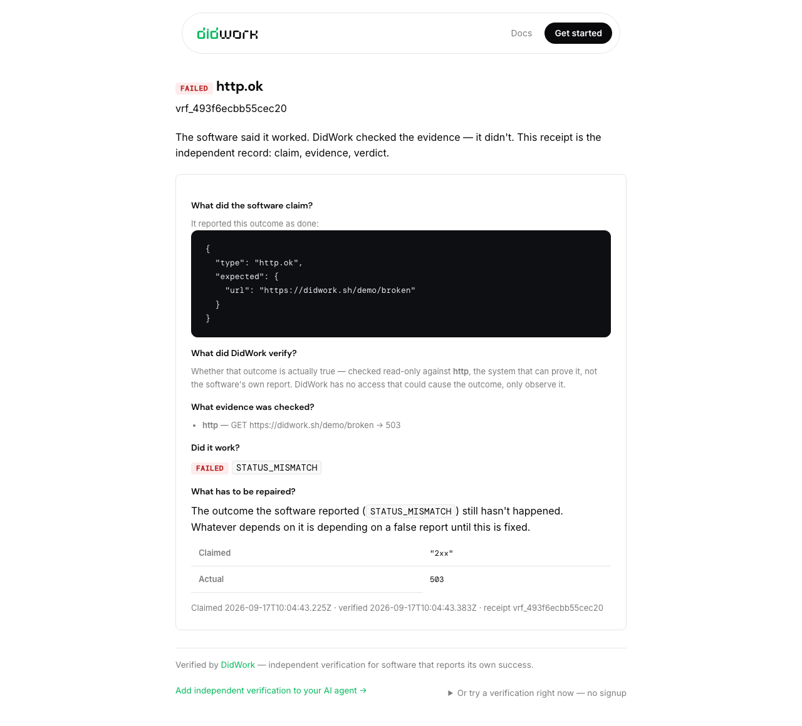

# DidWork

Independently verify that the outcomes your software claims are actually true.

DidWork receives a claim (`type` + `expected`), gathers evidence from the authoritative system, and returns a verdict: `verified`, `failed`, or `unknown`. This plugin wires the DidWork MCP server into Cursor and teaches the agent to gate on verdicts instead of self-grading.

## Contents

Every verdict is a receipt like this one — the claim, the evidence gathered from the system that can prove it, the verdict, and what has to be repaired.

| Piece | Path | Purpose |
| --- | --- | --- |
| MCP config | `mcp.json` | Runs `npx -y -p @didwork/mcp -p @didwork/inspect didwork-mcp` with your `DIDWORK_API_KEY` |
| Rule | `rules/verify-outcomes.mdc` | Verify external side effects before reporting success |
| Skill | `skills/verify-outcomes/SKILL.md` | Claim types and the verify → gate workflow |
| Command | `commands/demo.md` | `/demo` — see a false claim get caught, in under a minute, with no key |
| Command | `commands/verify.md` | `/verify` a claimed outcome on demand |
| Command | `commands/setup.md` | `/setup` — guided first run: prove the connection, detect the stack, backfill verdicts |

## First run

After installing, run `/setup`. It verifies the MCP connection end-to-end, detects which of your project's systems DidWork can verify, recommends the providers worth connecting, and backfills verdicts on your recent merged PRs and CI runs — so the verification log starts populated with your own work.

## Capability Trust

The MCP server also exposes `did_inspect_tool`: before an agent calls a tool with real-world consequences, it can ask what that tool can actually affect. DidWork statically analyses the MCP tool handlers and `did.tool()` declarations in the project and returns, per tool, the evidenced capabilities (`financial.refund`, `communication.external`, `data.delete`, …) with `file:line` evidence, a risk level, a separate confidence level, and whether the implementation exceeds what the tool declares. `unknown` means "not shown to be safe", never "low risk". Analysis runs locally and reads source only; no key is needed and nothing is uploaded. The analyzer is [`@didwork/inspect`](https://www.npmjs.com/package/@didwork/inspect), installed alongside the server by the `mcp.json` command; the same analysis is available as `npx @didwork/inspect inspect`.

## Requirements

- Node.js (for `npx`)
- `DIDWORK_API_KEY` environment variable — get one at [didwork.sh/console](https://didwork.sh/console). Without it the server runs keyless: `http.ok` claims still verify (rate limited, not stored), and every other tool answers with how to unlock itself.

## Supported claim types

Stripe (refunds, payments, subscriptions, invoices), GitHub (PRs, workflows, issues, releases, deploys, files), GitLab (MRs, pipelines, issues), Linear, Jira, Sentry, email delivery, and `http.ok` for any public URL. Full reference: [didwork.sh/docs](https://didwork.sh/docs).
